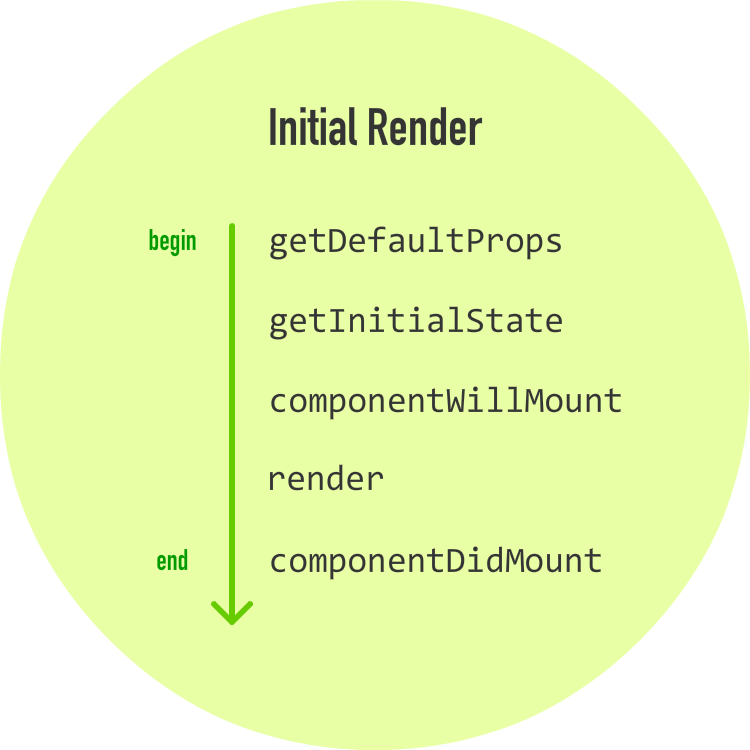
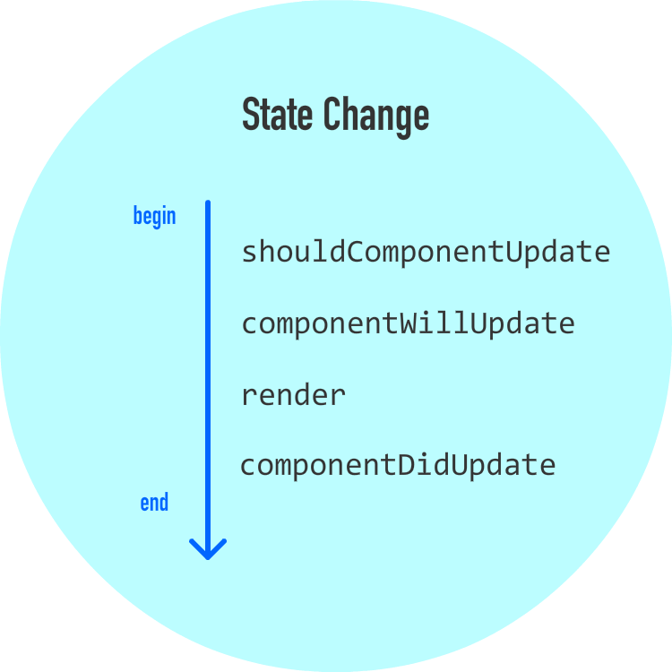
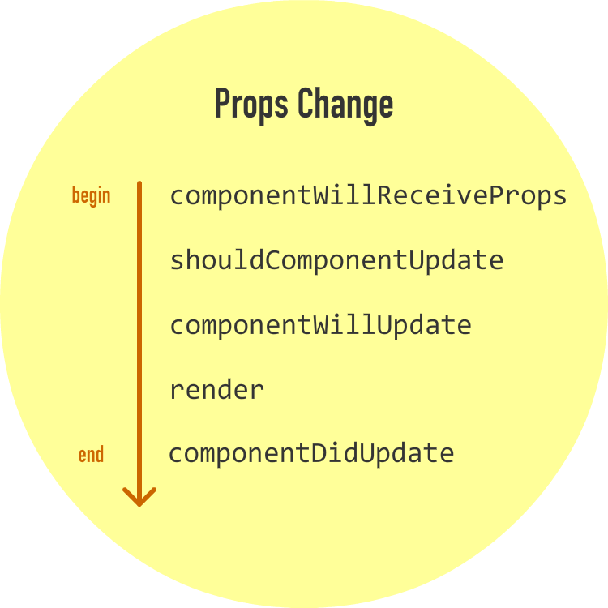

# react-study
start react code

### 教程
[从零开始学 ReactJS（ReactJS 101）](https://github.com/carlleton/reactjs101)

### 注意点

* JSX 不是 HTML
* 用 ES6 的类来定义组件，那么事件处理器中 this 的值就是 undefined，除非你自己显式绑定它`onClick={this.increase.bind(this)}`
* 注释
```jsx
ReactDOM.render(
  <div class="slideIn">
    <p class="emphasis">Gabagool!</p>
    {/* I am a child comment */}
    <Label/>
  </div>,
  document.querySelector("#container")
);
```

```jsx
ReactDOM.render(
  <div class="slideIn">
    <p class="emphasis">Gabagool!</p>
    <Label
      /* This comment
         goes across
         multiple lines */
         className="colorCard" // end of line
    />
  </div>,
  document.querySelector("#container")
);
```

* 必须确保 HTML 标记是小写字母：
* JSX 可以出现在任何地方
```jsx
var swatchComponent = <Swatch color="#2F004F"></Swatch>;

ReactDOM.render(
  <div>
    {swatchComponent}
  </div>,
  document.querySelector("#container")
);
```

### 生命周期



